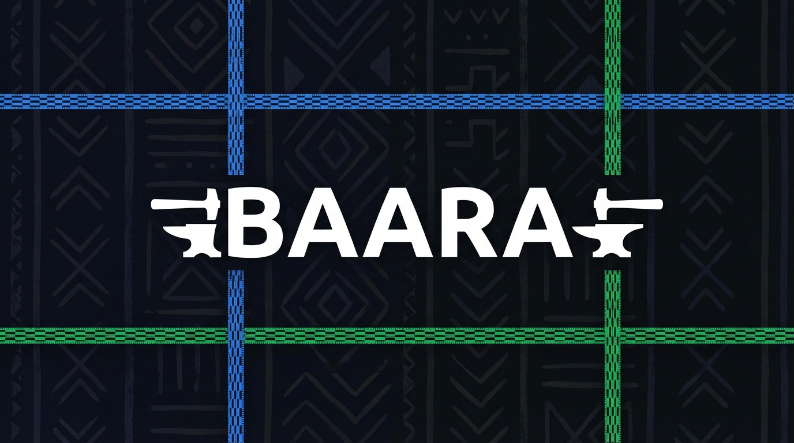
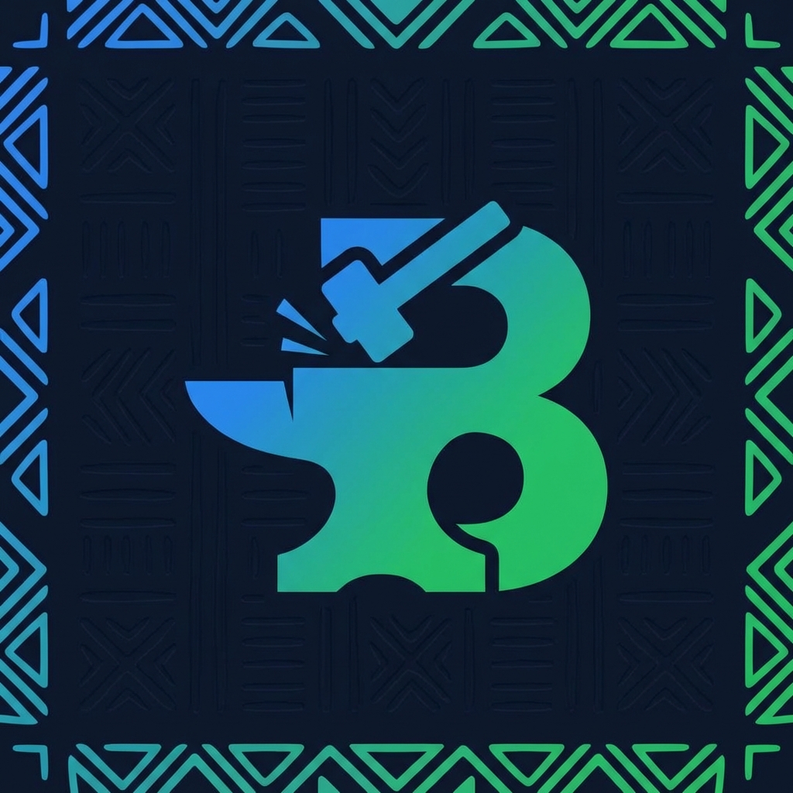

<p align="center">
  
</p>

<p align="center">
  
</p>

<p align="center">
  <strong>Baara</strong> — <em>"work" in Mandinka</em>
</p>

<p align="center">
  An agentic task execution system powered by the Claude Agent SDK.<br>
  Chat-first interface. Priority queues. Failure triage. Built for personal automation.
</p>

<p align="center">
  <a href="#quick-start">Quick Start</a> •
  <a href="#features">Features</a> •
  <a href="#cli">CLI</a> •
  <a href="#api">API</a> •
  <a href="#architecture">Architecture</a> •
  <a href="LICENSE">License</a>
</p>

---

## Quick Start

```bash
# Install dependencies
bun install

# Configure (subscription mode — no API key needed)
cp .env.example .env

# Start the server
bun start
# → http://localhost:3000
```

Open the web UI, type a message, and Baara handles the rest:

> *"Create a task that checks my email every morning at 6am"*

Claude creates the task, sets the cron schedule, picks the right tools, and confirms — all through natural language.

---

## Features

### Chat-First Interface

Talk to Claude in natural language. Baara exposes **19 MCP tools** via an in-process server — Claude picks the right tool for every request. Responses stream in real-time via SSE.

- **Slash command autocomplete** — type `/` for 153+ discovered skills with Tab completion
- **Plan mode** — toggle structured planning before execution
- **Session persistence** — conversations survive page reloads
- **Context-aware prompts** — Claude knows your task count, failures, and queue state

### Task Management

- **3-step creation wizard** — Basics → Execution → Schedule & Tools
- **Per-task tool selection** — choose which tools (WebSearch, Bash, Read, etc.) each task can use
- **Cron scheduling** — presets or custom expressions with human-readable preview
- **Run-once guard** — prevents duplicate execution of the same task
- **Configurable system prompt** — customize Claude's instructions per-instance

### Execution Engine

- **Dual execution modes** — Direct (immediate) or Queued (priority pipeline)
- **Priority queues** — P0 (critical) through P3 (background), FIFO within tier
- **At-least-once delivery** — configurable retry with exponential backoff
- **Failure triage** — exhausted retries flag jobs for human attention
- **Health monitoring** — detects slow and unresponsive jobs
- **JSONL execution logs** — append-only, streamable, `jq`-compatible

### Three Interfaces

| Interface | Description |
|-----------|-------------|
| **Web UI** | Chat + collapsible context panel (tasks, jobs, queues, logs) |
| **CLI** | `baara tasks`, `baara jobs`, `baara logs`, `baara status` |
| **Cron** | Scheduled execution via Croner — fires automatically |

All three share the same service layer. No duplicated logic.

---

## CLI

```bash
baara tasks list                     # List all tasks
baara tasks create --name <n> --prompt <p> [--cron <expr>]
baara tasks run <name>               # Execute immediately
baara tasks toggle <name>            # Enable/disable

baara jobs list <task>               # Job history
baara jobs triage                    # Failed jobs needing attention
baara jobs retry <job-id>            # Re-dispatch

baara logs                           # Execution logs
baara logs --level error             # Filter by level
baara logs --job <id>                # Per-job logs

baara commands list                  # Discovered skills + plugins
baara commands search "email"        # Search by keyword
baara status                         # System overview
```

---

## API

| Method | Endpoint | Description |
|--------|----------|-------------|
| `POST` | `/api/chat` | Chat with Claude (SSE stream) |
| `GET` | `/api/tasks` | List tasks |
| `POST` | `/api/tasks` | Create task |
| `POST` | `/api/tasks/:id/run` | Execute immediately |
| `POST` | `/api/tasks/:id/submit` | Dispatch to queue |
| `GET` | `/api/tasks/:id/jobs` | Job history |
| `GET` | `/api/jobs/triage` | Triaged jobs |
| `GET` | `/api/queues` | Queue status |
| `GET` | `/api/logs` | Execution logs |
| `GET` | `/api/projects` | Project management |
| `GET` | `/api/commands` | Discovered skills + commands |
| `GET` | `/api/health` | Health check |

---

## Architecture

```
┌──────────────────────────────────────────────────────────┐
│                        Baara                             │
│                                                          │
│  ┌─────────────────────┐  ┌─────────────────────────┐   │
│  │  Chat (Claude AI)    │  │  Context Panel          │   │
│  │  19 MCP tools        │  │  Tasks / Jobs / Queues  │   │
│  │  SSE streaming       │  │  Logs / Triage          │   │
│  └─────────────────────┘  └─────────────────────────┘   │
│                                                          │
│  Services ──► Dispatcher ──► Executor ──► SQLite         │
│  CLI ────────►                ↕                           │
│  Cron ───────►          Queue Manager                    │
└──────────────────────────────────────────────────────────┘
```

### Data Storage

```
~/.nexus/
├── baara.db                # SQLite — tasks, jobs, queues, projects
├── logs/
│   └── execution.jsonl     # Append-only execution logs
├── sessions/               # Chat session data
└── briefings/              # Scheduled task output
```

### Tech Stack

| Component | Choice |
|-----------|--------|
| Runtime | [Bun](https://bun.sh) |
| Web Framework | [Hono](https://hono.dev) |
| Database | bun:sqlite |
| Scheduler | [Croner](https://github.com/Hexagon/croner) |
| AI | [Claude Agent SDK](https://docs.anthropic.com/en/docs/agent-sdk) |
| Frontend | Vanilla JS (no build step) |
| Tests | [Playwright](https://playwright.dev) |

---

## Authentication

**Subscription mode** (default) — uses your Claude Pro/Max/Team subscription via the Claude Code CLI. No API key needed.

**API key mode** — set `BAARA_AUTH_MODE=api_key` and `ANTHROPIC_API_KEY` in `.env` for per-token billing.

---

## Security

- API key authentication (optional `BAARA_API_KEY`)
- Exact-origin CORS allowlist
- CSP + X-Frame-Options + X-Content-Type-Options headers
- Rate limiting (10 calls/min on execution endpoints)
- Input validation with clamped timeouts, retries, and budgets
- Graceful shutdown with WAL checkpoint
- Crash recovery for orphaned jobs

See [`docs/security/`](docs/security/) for the full security review.

---

## Development

```bash
bun start                    # Start server
bunx tsc --noEmit            # Typecheck
bunx playwright test         # Run tests (39+ test cases)
baara logs --follow          # Tail execution logs
```

See [CLAUDE.md](CLAUDE.md) for architecture details and conventions.

---

## License

[MIT](LICENSE)

---

<p align="center">
  <sub>Built with the Claude Agent SDK. Inspired by Mandinka craftsmanship.</sub>
</p>
